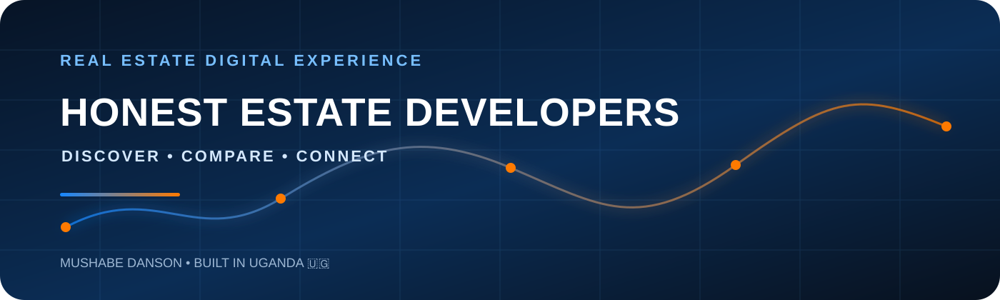

<p align="center">
  
</p>

<p align="center">
  <strong>A premium, responsive property experience for Honest Estate Developers Ltd, Uganda.</strong>
</p>

<p align="center">
  <code>React</code> · <code>Vite</code> · <code>React Router</code> · <code>Responsive UI</code> · <code>GitHub Actions</code>
</p>

---

## Direction

- Original design inspired by the information architecture and premium presentation of leading property portals.
- Dominant white interface with restrained HED yellow, red and blue accents.
- Data-driven property catalogue, search/filtering, service pages, company information, insights and lead-generation CTAs.
- Current property/company information is sourced from HED's existing public website and should be verified by the client before final production launch.

## Stack

- React
- Vite
- React Router
- Lucide React

## Local development

```bash
npm install
npm run dev
```

## Build

```bash
npm run build
```

## GitHub Pages

The repository includes a GitHub Actions Pages deployment workflow. In repository **Settings → Pages**, set the source to **GitHub Actions** if it is not already enabled.

## Important content note

The old HED website contains some generic real-estate template/demo content (for example a Tampa address and unrelated property features). That content has intentionally not been migrated.

---

<p align="center"><strong>Purpose-built digital presentation for a Ugandan real-estate brand.</strong></p>
